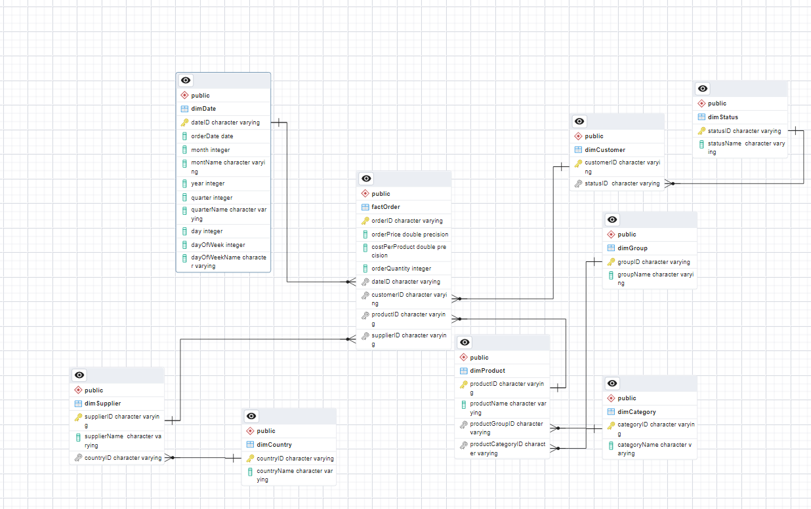
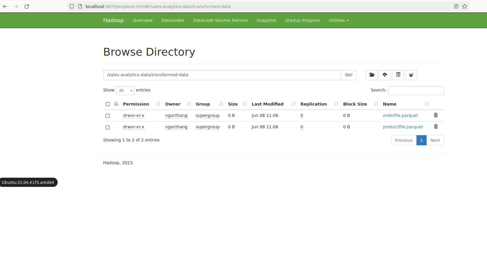

# Sales analytics Projects

## Project Description:

 ** Using Pyspark to extract dataset from local storage.

 ** Analyze data in files and plan a suitable data pipeline and storage.
 
 ** Utilize ERD features in PostgerSQL to desgin a suitable snowflake schema.
 
 ** Perform 3 statges of data transformation to clean data, correct datatype and make suitable format for the schema.

 ** Save the files in parquet format on Hadoop HDFS.
 
 ** Load the completely transformed data from HDFS into data warehouse for further usage.

## Project Architecure

## Snowflake Schema

## Transformed file stored on HDFS storage

## Compleltely transformed file stored om HDFS storage

