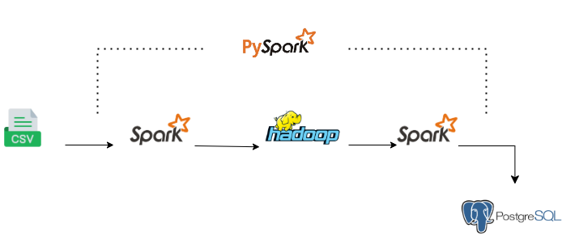

# Spotify Data Pipeline (ETL) Project Using Python

## Project Description:
The Spotify Data Pipeline (ETL) Project Using Python and  AWS cloud services to automate the extraction, transformation, and loading (ETL) process of Spotify API data. This project transforms raw data from the Spotify API into a structured and query-ready dataset, enabling insightful data analysis and visualization.
 ** Using Pyspark to extract dataset from local storage.
 ** Perform transformation to validate the correct format of data and change csv format to parquet format.
 ** Use features of HDFS to store the large transformed dataset.
 ** Perform data warehousing on PostgerSQL to store transformed data.
 ** Load the data into data warehouse for further usage.

## Project Architecure

## Snowflake Schema

