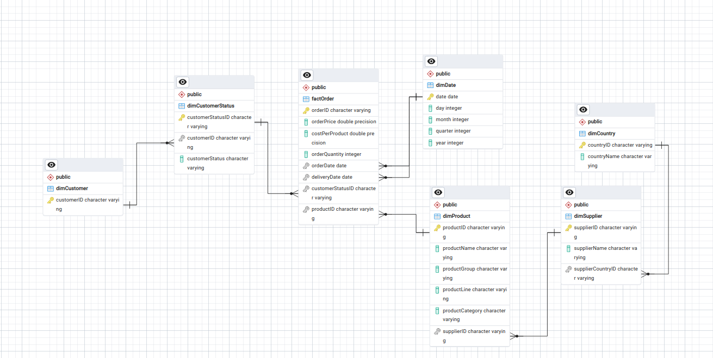
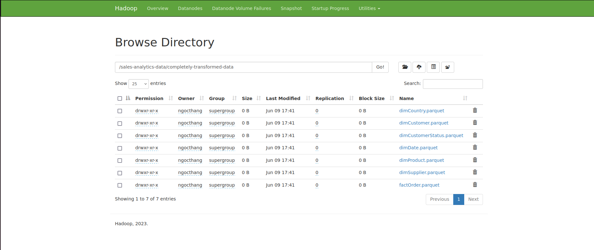

# Sales analytics Projects

## Project Description:

 **Using Pyspark to extract dataset from local storage.

 **Analyze the extracted data and plan a suitable schema for an efficient storage.
 
 **Utilize ERD features in PostgerSQL to desgin a suitable snowflake schema.
 
 **Perform statges of data transformation to clean, correct datatype and format the data to  the schema.

 **Save the files in parquet format on Hadoop HDFS.
 
 **Load the completely transformed data from HDFS into data warehouse for further usage.

## Project Architecure

## Snowflake Schema

## Transformed file stored on HDFS storage

## Compleltely transformed file stored om HDFS storage

